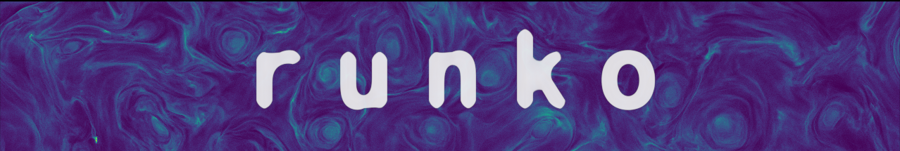

# Modern C++/Python CPU/GPU-portable plasma toolbox

[](https://runko.readthedocs.io/en/latest/?badge=latest) [](https://github.com/natj/runko/LICENSE) 

R̯̥͎̺͚̙͈̖̝̩̘ͅu̖̩̹̤n̪̰͚̭̬̮̼͎̥͓ͅk̲̟͎͓̭̝o͔͙̗͓͇̺͇̥̜͖̥̹̘̼ i̪̮̠͇̪̯̲͕̪̻̫̹s͕̫͈̲͙͕̻̜ a̙̻̘͎̞͖̮͚̺̲̮͍͇̮͚ m̺̤͍̻̬͕̯̳̣o͙͔̠͕̠͓̥d̝̘̩̟̲̬͎͍̲e̮̭͉̖̣r̯̬̣̫̹̤̖n̼̪̥͚̫̱̜̞̫̼͔̙̯̜ C̹̻̮͎̰̟̻̭̝ͅ++/P̠̬͕y̦̣͎̜̬̯͖̩̬͍͓͈͙t̥̳̦̠h̬͇͕̭o̦͖̲͎̖n͈̟̬͓̤̖̬̬̼̙̳͖͇̤ C̯̼͙P̰̮̪͍̖̘͓͙͍U͙̺͚̖̫̖͕̖̥͕̼ͅ/G̞͕̮P̖͔̯͙̻̤̬̙̳͙̙̰U͕̹͓̹͇̻̯̰ 3D͈̞͖̺̱̯͎̖͖̱͎̰̯̲̦ͅ r̠͍̲̝̖̖͚̪͉͍̙͔̪̟͕̦ͅͅa͕̜̗̮̲̹̜͇̭̗̬͉̭̻̪̲̖ḓ̠̝̺̟͈͖̞̭̼ͅͅi̥̯̦̺͚͚̫̻̟̤a͚͇͈͔ṯ͖̬̙̠̻̦̩̺͖͙͕̝i͉͙ͅv̪̰̤̜̰̲e͓̖̤͉̮̞͚̹̯̭̗̣̭̟͇̣ͅ p̜͈̺̫̣̬̝̭̲̻ͅl̯͚̣̜̹̣̝͍̜ͅa̼̥̹͎͎̲̫̮̮s̳̣͙͖̠̘͈̣͇̹̮ͅm̲͙͖͕̥̫͕̲͎̪͎̜ͅa̭̥̹ c̞͕̗̙͎̞̣͉̥̹o͍͍͎̭̰̦̣̥͖̦d̮̥̙e͔͍̺̼̦͉̘̜̥̜̪̗̟̰ b̗̲̝̘̩̩̫̣̟̮̳̥̰͉̮̲͖ỵ͖͉ a̜͚͉̲̬̲̦̲̝n̠̝̪̮͈̭̹̲͕d̳̫̹̙̤̥̬̬̜̫̙͚ f͔̱̱̥̠̲̟o͔̠̦̠͕̪͍̤ṟ̜̣͉̥̖͓̳̯̳̜͇͓̬̱̖͖ͅ t̪̩̲̺̖̱̯̮̹̯̫̝̳͈̥̤̯̥h̻̫͕̗͍̼̦̰̹͔͙̣̯̱e̜̳͕̖̱̞̠ͅͅ ḁ̹͚͓s̯̖͔̭͍̼͍̺̰̭ͅt͔̫̰͇͍̥̹̺̹̫̠̲͎̠ͅr̰͖̲̟͓̰͇̜̖̼̙͔͖͈o̜̦͈̼͉ͅp̲̬̭͔͕͍̩͇͚͉̮̤̞̥͍ͅh̲͍͉y͉̖̣͔͎͔̥͎̣̮̰s̗͓̳̗͖̯͍̱͖̖̺̣̤̺̬͉̭̣i̩̠̖c̻̹͕̰͚̣̗̳̠̫̖̲̥͇̦̺s͉̩̙̝̰̥͍̙ c͔̥͎̺̜̗̣̱̘̲̝͔͈̥̘̱̪o̞͇̹̘̣͙͓̜̯͖̦̲͕͖̤̠m̭̼̦͎̦̙̭̝̟͓ͅm̝̖͓̮̪̬̰u̖̯̤͕͚̩͓̘͖n̺̜͎̣i̳̻͖̟̩͇̖̥͚̩̻̠̱̹t͎̗̤̲̞͓̤̦͙̰̞̭̭̫͔̫̬̮y̖̩͍͍̫̹͙̜̺͓͉̟̣͈̤̺.
</br>
</br>
</br>

Runko is a fully open-source simulation framework written in modern C++/Python to simulate astrophysical plasmas. Technologically, the framework is composed of separate physics modules that can be used independently or combined together to create multi-physics simulations. Low-level computing "kernels" are implemented in modern C++, allowing to write modular and high-performance code. High-level usage of the code is controlled with Python scripts exposing the C++ code to Python objects. The hybrid design ensures efficient code, rapid prototyping, and ease of use.

Under the hood, the framework uses the massively parallel grid infrastructure library [corgi](https://github.com/natj/corgi) that decomposes the grid into smaller subregions called tiles. [Corgi](https://github.com/natj/corgi) also automatically parallelizes the simulations and provides dynamic load-balancing capability. Therefore, small simulation setups can be tested locally on laptops and then extended into massively-parallel supercomputer platforms (currently tested up to ~20k cores).

Documentation is available from [runko.readthedocs.io](https://runko.readthedocs.io/en/latest/?badge=latest). 

The design and usage of the code are described in detail in the accompanying [paper](https://arxiv.org/abs/1906.06306).


## Available modules
Current main physics simulation modules include:
- **3D3V Particle-In-Cell module** (`pic/`)
- **3D FDTD electromagnetics module** based on staggered Yee lattice (`emf/`)
- **3D Force-free electrodynamics** module (`ffe/`)
- **1D3V Relativistic Vlasov module** (`vlv/`)
- Non-linear Monte Carlo **radiation module** (`qed/`)


## Quick getting started guide
1) Follow the [installation instructions](https://runko.readthedocs.io/en/latest/installation.html) to get Runko running on your laptop.
2) Add your own project repository under the `projects/` directory.
	- This can be based on, for example, Python drivers in `projects/tests/`
3) Test & prototype your new simulation setups on your laptop/desktop.
4) Simulate on supercomputers!

## Showcase
	

### Relativistic kinetic turbulence 	
PIC module has been used to simulate the formation of turbulence in collisionless magnetically-dominated pair plasma.

We start by perturbing the initial magnetic field with harmonic sinusoidal modes. Magnetic eddies are quickly seen to develop. When the eddies collide, thin current sheets are formed. These thin sheets are unstable to magnetic reconnection that starts to tear the sheets and produce plasmoid.

</br>
</br>
</br>

### Collisionless shocks


PIC module has been used to simulate collisionless shocks in 2 and 3D. These simulations use the common reflecting wall setup where moving plasma is reflected from the leftmost simulation wall and made to collide with itself. A collisionless shock is quickly formed, stopping the counter-streaming plasmas.


### Plasma instabilities

	

Vlasov module has been used to simulate the development of beam instabilities in a stratified medium. 

In this 1D1V simulation setup, we track the development of stratified beam instability in an atmosphere with a density contrast of over 5 orders of magnitude. Deep in the atmosphere, the penetrating beam excites Langmuir wave turbulence and heats the background plasma. 

## How to cite?

You can use the following BibTeX template to cite Runko in any scientific discourse:
```
@ARTICLE{runko,
       author = {{N{\"a}ttil{\"a}}, J.},
        title = "{Runko: Modern multiphysics toolbox for plasma simulations}",
      journal = {\aap},
     keywords = {plasmas, turbulence, methods: numerical, Physics - Computational Physics, Astrophysics - Instrumentation and Methods for Astrophysics, Physics - Plasma Physics},
         year = 2022,
        month = aug,
       volume = {664},
          eid = {A68},
        pages = {A68},
          doi = {10.1051/0004-6361/201937402},
archivePrefix = {arXiv},
       eprint = {1906.06306},
 primaryClass = {physics.comp-ph},
       adsurl = {https://ui.adsabs.harvard.edu/abs/2022A&A...664A..68N},
      adsnote = {Provided by the SAO/NASA Astrophysics Data System}
}
```

