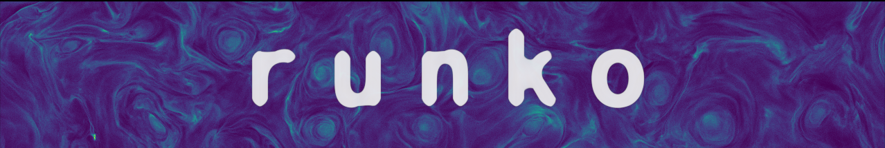

Runko --- modern toolbox for plasma simulations 
==========================================================

Runko is a modern numerical toolkit for simulating astrophysical plasmas.
It is written in C++23/Python3 and is designed to be highly modular.
The name originates from the Finnish word *runko* meaning literally "a frame".

To get started, follow these manual pages in order.
This will get you up-to-date in the prerequisites, installation, and understanding the various algorithms.
Notes and tips that focus on code development are listed at the end of the manual.

.. Warning::

   This documentation is about Runko v5 which contains major breaking changes compared to v4.
   Runko v5 comes with HIP based GPU backend which required significant refactors and API changes.
   Some features present in v4 are not (yet) ported for v5.

Physical modules
----------------

The framework consists of various physics modules that can be run independently
or combined together to create multi-physics simulations. Different modules include:

* Finite difference time domain electromagnetic module
* Particle-in-cell (PIC) module

About
-----

This project was originally developed by `Joonas Nättilä <http://natj.github.io/>`_ while in Nordic Institute for Theoretical Physics (NORDITA). 
Key contributors that provided additional features and/or improvements include

* Fredrik Robertsen (CSC)
* John Hope (Univ. Bath)
* Kristoffer Smedt (Univ. Leeds)
* Camilia Demidem (Nordita)
* Maarja Bussov (Univ. Helsinki)
* Alexandra Veledina (Univ. Turku)
* Miro Palmu (Univ. Helsinki)

.. raw:: html

    

.. role:: blue

:blue:`Recent changes`
----------------------

* :blue:`21/05/2021 Added a PIC algorithm section`
* :blue:`20/05/2021 Added a theory section for Vlasov-Maxwell systems and FDTD method`
* :blue:`19/05/2021 Added a unit conversion tool`
* :blue:`15/05/2021 Launched the improved web manual`

------

.. toctree::
   :maxdepth: 2

   installation

.. toctree::
   :caption: Theory:
   :maxdepth: 2

   theory
   units
   plasma

.. toctree::
   :caption: Algorithms:
   :maxdepth: 2

   fld
   pic
   vlv
   ffe
   qed
   algorithms

.. toctree::
   :caption: Tutorials:
   :maxdepth: 2

   usage
   shocks

.. toctree::
   :caption: Developer notes:
   :maxdepth: 2

   unittool
   clusters
   vectorization 
   messagesize
   versions
   style
   documentation
   debugging
   publications

.. toctree::
   :caption: Runko module
   :maxdepth: 2

   runko-module/intro
   runko-module/installation
   runko-module/pic-tutorial
   runko-module/api
   runko-module/dev-notes

